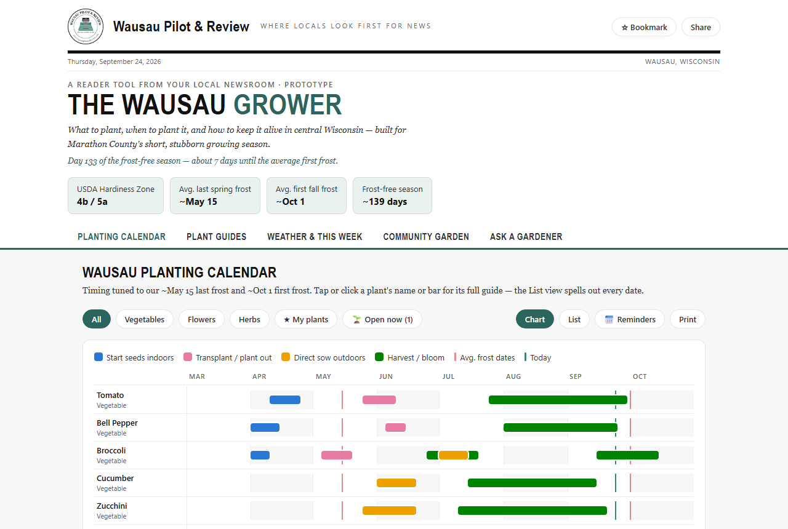

# The Wausau Grower

A year-round garden companion for **Wausau Pilot & Review** readers — what to plant, when to plant it, and how to keep it alive in central Wisconsin's zone 4b/5a. Fully branded to the newsroom: the typewriter seal, the Oswald/Merriweather newspaper typography, and the teal pulled straight from the typewriter itself.

## What it does

**Planting Calendar** — a visual March–October timeline for 31 flowers, vegetables, and herbs, anchored to Wausau's ~May 15 average last frost and ~Oct 1 first frost, with a live "today" marker, fall succession windows, chart/list views, and a one-page printable version.

**Plant Guides** — searchable, filterable growing guides with sun, spacing, watering, difficulty, and zone-4b/5a-specific tips for every plant — each with its own hand-drawn SVG illustration (root vegetables get a below-ground cutaway), a personal notes field, and "keep exploring" suggestions that favor plants whose windows are open today. A live "season pulse" line in the masthead counts the frost-free days as they pass.

**Weather & This Week** — the live National Weather Service forecast for Wausau translated into garden decisions: frost-risk flags on nights ≤36°F, a "clear to transplant" status banner, rain probability, season-progress stats, a monthly task list, and a "planting windows open right now" panel generated from the plant database.

**Community Garden** — reader photo posts with likes, comments, a submission form, and a Garden of the Week badge.

**Built to bring readers back** — starred "My plants" lists, per-plant notes, likes, and a checkable monthly task list all persist on the reader's device (localStorage, no account needed); a **📅 Reminders** button exports the starred plants' planting windows plus both frost dates as an `.ics` file for Google, Apple, or Outlook Calendar, so the tool reaches readers even when they aren't on the page; the "open right now" panel also lists windows opening in the next 30 days (and, in winter, the first indoor starts of spring); plant cards show live "Sow now" / "Plant now" chips when a window is open; every tab and plant guide has a bookmarkable deep link (`#weather`, `#plant/tomato`); a "Welcome back" strip summarizes which planting windows opened since the last visit and warns when a starred plant's window is about to close; and Bookmark/Share buttons plus a newsletter call-to-action close the loop with the newsroom.

**Built to survive the real world** — each section boots independently (a corrupted browser-storage value or a failed render is logged, never a blank page); typed storage readers discard tampered values; the NWS call checks status codes and retries once before showing a Try-again state; the plant database is sanity-checked on load with console warnings for editors; the modal is a proper `role="dialog"` with an inert background, and every opener (cards, calendar names, open-window links) is keyboard-reachable; and when embedded in an iframe the page posts its height to the host (`wpr-embed-height`), hides the Bookmark button, shares the host article's URL, and anchors dialogs where the reader clicked.

## Running it

It's one self-contained HTML file. Open `index.html` in a browser, or serve it from any static host — no build step, no dependencies, no server-side code. External calls from the reader's browser: `api.weather.gov` (free, keyless, CORS-enabled) and Google Fonts (Oswald/Merriweather, with system serif fallbacks if offline). The Pilot & Review seal is embedded in the file itself.

## Configuration

A single `CONFIG` object at the top of the second `<script>` block:

- `sponsor` — set `{ name, url }` to show a "Presented by" masthead credit (renders with `rel="sponsored"`). `null` hides the slot.
- `submitEndpoint` — a URL accepting POST JSON `{who, where, kind, cap}` to route community submissions into a moderation queue. `null` runs the form in local demo mode.
- `newsletterUrl` — where the "Join the newsletter" buttons point. Defaults to the homepage; swap in a dedicated signup URL.

See [docs/deploy.md](docs/deploy.md) for the full production checklist and [docs/pitch.md](docs/pitch.md) for the concept proposal.

## Data sources

Every figure is documented, with citations and a date-by-date cross-check against UW–Madison Extension's planting guide, in [sources.html](sources.html) (published alongside the tool and linked from its footer and every plant guide). In brief: the 2023 USDA Plant Hardiness Zone Map (Wausau sits on the 4b/5a boundary); NOAA NCEI 1991–2020 Climate Normals for the Wausau Downtown Airport station (50% frost dates May 6 / Oct 2 — the tool anchors conservatively to ~May 15 / ~Oct 1); UW–Extension publication A1653, *Vegetable Cultivars and Planting Guide for Wisconsin Gardens*, with its Madison dates shifted 1–2 weeks later per its own central-Wisconsin footnote; Wisconsin Horticulture (UW–Madison Division of Extension) for herbs, ornamentals, and shrubs; and the National Weather Service API for live forecasts. The guides have not yet been reviewed by a horticulturist — the Marathon County Master Gardener Volunteers have been invited to do that review, and three dates are flagged for them on the sources page.

## License

MIT — see [LICENSE](LICENSE).
