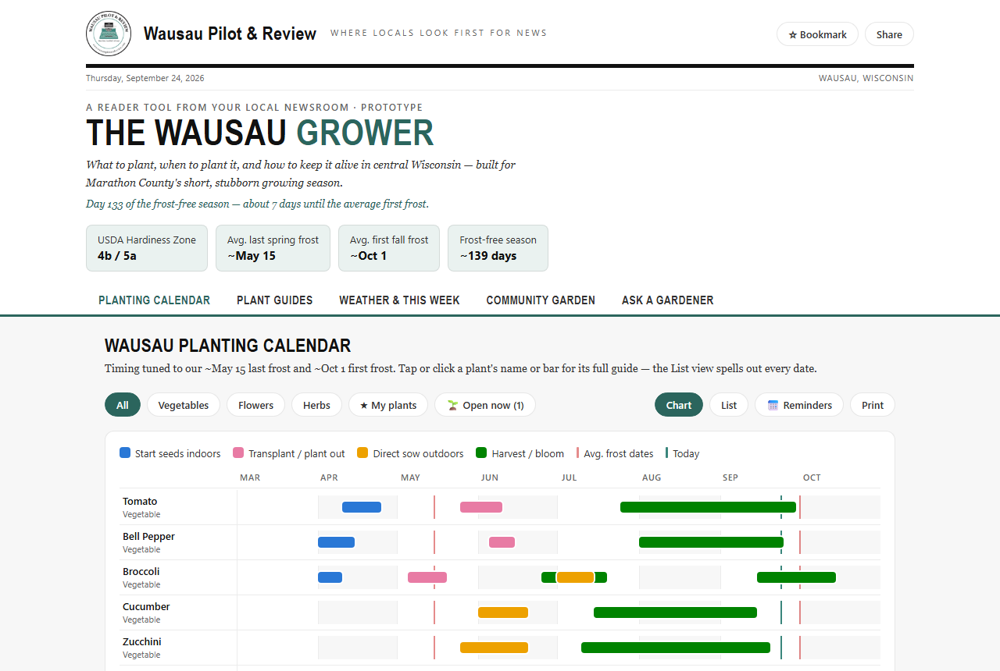

# The Wausau Grower

A year-round garden companion for **Wausau Pilot & Review** readers — what to plant, when to plant it, and how to keep it alive in central Wisconsin's zone 4b/5a. Fully branded to the newsroom: the typewriter seal, the Oswald/Merriweather newspaper typography, and the teal pulled straight from the typewriter itself.



## What it does

**Planting Calendar** — a visual March–October timeline for 79 flowers, vegetables, herbs, native plants, and grasses, grouped by category (each group with its own month axis) under an "Open now" group that leads the full view with the plants you can plant today, your starred plants first and then the windows closing soonest, each with its step and deadline ("Plant through Oct 25"), anchored to a ~May 15 last-frost date and ~Oct 1 first-frost date (NOAA's medians for Wausau are May 6 and Oct 4), with NOAA's frost odds shaded behind every row (solid where frost is near-certain, fading to the one-in-ten dates), a live "today" marker (the month row tags Today and both frost lines, so they never read as one; on a phone chart scrolled sideways, a frost tag that won't fit beside the plant names or Today moves to its line's far side or shortens to "Frost", so every frost line in view stays named, and month names ride along the names' edge instead of showing cut), planting windows that name the step where it isn't a transplant (plant cloves, seed potatoes, sets, bare-root divisions; plant or divide), fall succession windows, chart/list views, and a printable fridge calendar (one page per category, two for the full list). The first time the chart is on screen (inside an article, on the reader's screen), its bars draw in from each window's first day to its last and the today line drops down through the rows; it plays once a page load.

**Plant Guides** — searchable, filterable growing guides with sun, spacing, watering, difficulty, and zone-4b/5a-specific tips for every plant — each card leading with the plant's next Wausau planting step and its dates ("Plant cloves · Oct 1–25", two cards across on phones) and the grid sorted by what's next, each guide opening with its whole drawing (16:9 on a phone; on a wider dialog the sky and ground run on past the drawing instead of cutting it to a strip) and a one-row timeline of the plant's planting windows that leads with its status today in the calendar's words ("Open now: plant cloves through Oct 25."), names its lines with the calendar's own Today and frost tags, hatches next year's harvest from this year's planting (garlic's July), and, under a pointer or a finger slid along it, names the day, that day's window and its NOAA frost odds, and each with its own hand-drawn SVG illustration (under a faint night sky in dark mode, and frosted on a frost night: when the forecast calls for frost, the ground in every picture turns pale and rime gathers in the corners) (root vegetables get a below-ground cutaway; leaves, fruit and flower heads are shared shapes drawn once per page in `#art-defs` and placed with `<use>`, so the detailed drawings cost about what simple ones would), a personal notes field (cards flag the plants you've written about), a guide opened from its card that grows out of the card and runs back into it on close (the dialog itself opens at once; readers who ask for less motion get a plain open), a star that sends up a sprout when set, a Share button that sends the guide's own preview page (`plant/<id>.html`, built with its drawing and dates by `tools/build_previews.py`, so the link previews as that plant in texts and feeds and then opens the guide), and "keep exploring" suggestions that favor plants whose windows are open today. Plants that NC State Extension rates High or the University of California rates Class 1 for poisoning stay out of the tool (vegetables excepted), and guides for plants that can still cause harm carry a Safety line (see sources.html#safety). An **Open now** filter on the calendar and the guides answers the question the tool exists for: what can I plant this week? A live "season pulse" line in the masthead counts the frost-free days as they pass.

**Weather & This Week** — a dated "This Week in the Garden" front: the day's advice as headline and lede, a Frost outlook box, and the live National Weather Service forecast for Wausau, one card per day with the high, the overnight low, and an icon drawn to match the plant art. It's translated into garden decisions: frost flags on nights ≤36°F and on any forecast that mentions frost or a freeze (a dawn frost is tied to the night before it, so readers know which night to cover; on a frost night the warning also replaces the season line under the title and marks the This Week tab, embeds included, and spring "Open now" chips on after-frost windows say to wait; this starts in mid-April, when hardy crops go in and seedlings go out to harden off, so a frost night before the ~May 15 last-frost date says to bring seedlings in, while hardy crops' own windows stay open), wherever it says to cover, how and until when (old sheets, blankets, or cardboard boxes put on before sundown, propped off the leaves and weighted to the ground, plastic kept off the foliage, off once it’s above freezing the next morning, from Extension guidance cited on sources.html), a headline that names the coldest night ahead (and, in October, says when a frost-free week means tender crops can stay out; from mid-May through June it names the tender crops by their own planting windows, as in "tomatoes, beans, squash, and zinnias go in May 25; basil and cucumbers Jun 1; peppers Jun 5", and says "clear to plant" only with a forecast in hand), rain probability, season-progress stats, a monthly task list, and an "Open now for planting" panel generated from the plant database, which words every deadline the way the calendar does ("through May 10", "through today", and "3 days left" inside a week).

**Community Garden** — reader photo posts with a submission form and a Garden of the Week badge. Likes and comments show only in the prototype demo, since they have no backend yet; at launch the tab appears once `submitEndpoint` is set or real posts exist.

**Ask a Gardener** — a sponsorable question desk: readers submit gardening questions (every plant guide links to it pre-filled), the sponsoring organization answers them, and the best run in the Ask a Master Gardener column. Once answers are published, adding them to `COLUMN` shows them in the tab with bylines; until then it shows example answers, labeled as examples. Sponsor lockup per WPR conventions, `?demo` sales preview, three delivery modes (endpoint, mail app, prototype). Offer sheet in [docs/ask-a-gardener.md](docs/ask-a-gardener.md).

**Built to bring readers back** — starred "My plants" lists, per-plant notes, a checkable monthly task list, and an unsent Ask a Gardener question all persist on the reader's device (localStorage, no account needed); a **Reminders** button exports the starred plants' planting windows plus both frost dates as an `.ics` file, each event set to alert a few days ahead, for Google, Apple, or Outlook Calendar, so the tool reaches readers even when they aren't on the page; the "Open now for planting" panel shows the six most urgent open windows (starred plants first) with a link to the rest in the calendar, plus up to four opening in the next 30 days (and, in winter, the first indoor starts of spring); plant cards show a live "Open now" chip when a window is open (on phones a pill in the card's text, so it never covers the drawing), and each guide's status says what the garden is doing today, a harvest or bloom under way or near, then the next planting ("Harvest from Jul 25. Next: start indoors from Apr 10 next year."); every tab and plant guide has a bookmarkable deep link (`#weather`, `#plant/tomato`), and the address keeps the calendar's filter and Chart/List choice and the guides' filter and search (`?calendar=vegetables&view=list`, `?guides=herbs&q=pickle`), so a reload, a bookmark, or a shared link opens on the same view; plant names, guide cards, and the "→" links are real links, so Ctrl/Cmd-click, a middle click, or "Open in new tab" opens a guide in a tab of its own; a "Welcome back" note under the title (in the deck's place) leads with any starred plant whose window closes this week (saying wait on a spring frost night) and says what opened since the last visit (on phones, and in article embeds 720px wide or narrower, the title carries one status line, chosen in order: a frost alert, then this note, then the season line, which also wins in October because it already names what's still open; at 360px and narrower the dateline and kicker drop so the title follows WPR's flag); and Bookmark/Share buttons plus a newsletter call-to-action close the loop with the newsroom.

**Built to survive the real world** — each section boots independently (a corrupted browser-storage value or a failed render is logged, never a blank page); typed storage readers discard tampered values; the NWS call checks status codes and retries once before showing a Try-again state; the plant database is sanity-checked on load with console warnings for editors; the modal is a proper `role="dialog"` with an inert background, and every opener (cards, calendar names, open-window links) is keyboard-reachable; skip links jump past the masthead and past the calendar's plant rows, each calendar name is described by its status today and then its windows ("Open now: plant cloves through Oct 25"), the chart's Mar–Jul cue is a keyboard button, closing a guide or sending a question leaves focus on something useful, decorative emoji and stars are hidden from screen readers, filter chips and the Chart/List switch report which is on (`aria-pressed`) and the calendar announces what it now shows, and a guide's close button stays on screen while it scrolls; forecast and form failures are explained in plain language; and when embedded in an iframe the page posts its height to the host (`wpr-embed-height`), matches the article's light theme even on a dark-mode device, places dialogs and pop-up messages beside the reader's last tap, hides the Bookmark button, and falls back from sharing to copying to showing the link when the host blocks it. Opening a plant guide adds a history entry, so the Back button closes the guide instead of leaving the page. A `prototype` switch keeps demo content from ever going live as real.

## Running it

It's one self-contained HTML file. Open `index.html` in a browser, or serve it from any static host — no build step, no dependencies, no server-side code. External calls from the reader's browser: `api.weather.gov` (free, keyless, CORS-enabled) and Google Fonts (Oswald/Merriweather, with system serif fallbacks if offline). The Pilot & Review seal is embedded in the file itself.

## Configuration

A single `CONFIG` object at the top of the second `<script>` block:

- `sponsor` — set `{ name, url }` to show a "Presented by" masthead credit (renders with `rel="sponsored"`). `null` hides the slot.
- `submitEndpoint` — a URL accepting POST JSON `{who, where, kind, cap}` to route community submissions into a moderation queue. `null` runs the form in local demo mode.
- `newsletterUrl` — where the "Join the newsletter" button points. Defaults to WPR's "Subscribe for free" signup page (`/sign-up/`).
- `prototype` — `false`: the tool has been in launch mode since October 4, 2026, so demo posts and prototype labels are off and any form without somewhere to send is hidden instead of faked. Set it to `true` to preview the prototype features.
- `askSponsor`, `askEndpoint`, `askEmail` — the Ask a Gardener sponsor lockup and where questions go (see the deploy guide). Questions currently go by email to the Master Gardeners' Ask a Master Gardener inbox.

See [docs/deploy.md](docs/deploy.md) for the full production checklist and [docs/pitch.md](docs/pitch.md) for the concept proposal.

## Testing

A Playwright regression suite covers behavior, seasons, embedding, printing, the sources page's agreement with the plant data, and a WCAG AA contrast audit in light and dark mode. It runs offline and on every push via GitHub Actions:

```bash
pip install playwright
python -m playwright install chromium
python tests/smoke_test.py
```

## Data sources

Every figure is documented, with citations, in [sources.html](sources.html) (published alongside the tool and linked from its footer and every plant guide), and every planting window is cross-checked there against at least two independent institutions: UW–Madison Extension plus the Extension services of the University of Minnesota, Purdue, Cornell, the University of Illinois, Iowa State, Penn State, and the University of Maryland, and the Morton Arboretum. In brief: the 2023 USDA Plant Hardiness Zone Map (Wausau sits on the 4b/5a boundary); NOAA NCEI 1991–2020 Climate Normals for the Wausau Downtown Airport station (median frost dates May 6 and Oct 4, matched by the Wisconsin State Climatology Office; the tool plans conservatively around ~May 15 / ~Oct 1); UW–Extension publication A1653, *Vegetable Cultivars and Planting Guide for Wisconsin Gardens*, with its Madison dates shifted 1–2 weeks later per its own central-Wisconsin footnote; and the National Weather Service API for live forecasts. The guides are compiled by Wausau Pilot & Review and are not reviewed or endorsed by Extension or the Master Gardener Program; the plant list was expanded with suggestions from the North Central Wisconsin Master Gardeners Association. The test suite fails if the sources page and the tool ever disagree about a date or a plant's sources.

## License

MIT — see [LICENSE](LICENSE).
